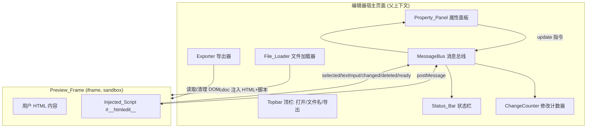
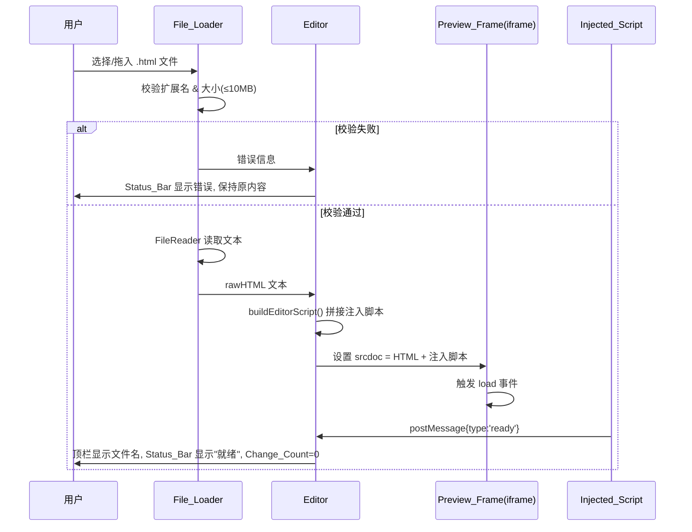
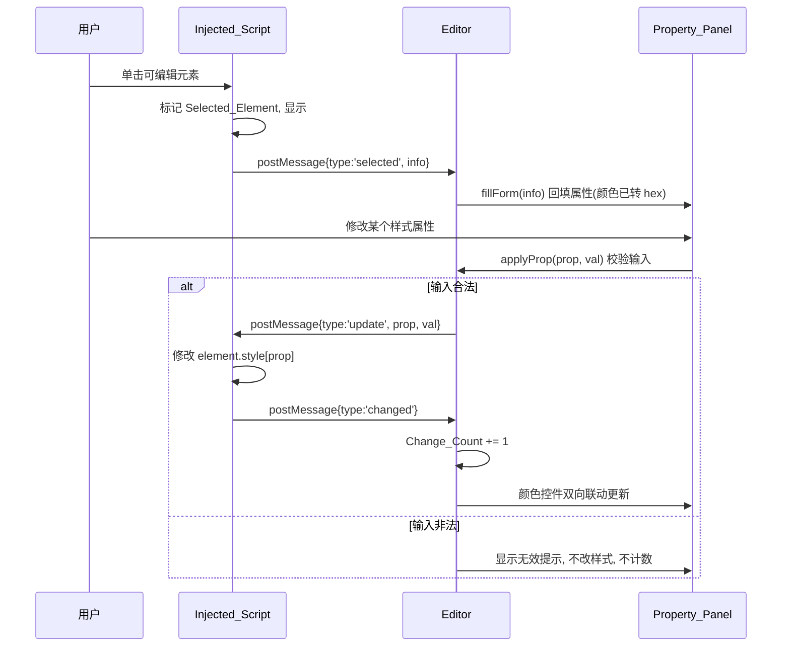
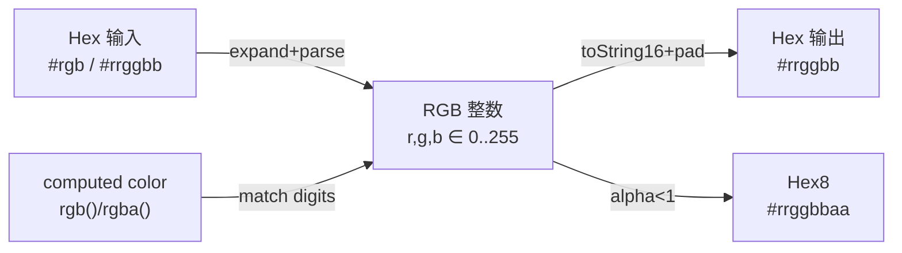

# Design Document

## Overview

HTML 可视化编辑器是一个**单文件、零依赖**的 Web 应用（`html-editor.html`），采用纯 HTML + Vanilla JS 实现，可直接在任意现代浏览器中通过 `file://` 协议打开运行，无需构建工具或服务器。

核心设计思路：

- **隔离渲染**：用户的 HTML 通过 `<iframe srcdoc>` 渲染，配合 `sandbox="allow-scripts allow-same-origin"` 既保证原始样式与脚本完整呈现，又将用户内容与编辑器宿主页面隔离。
- **注入式交互**：编辑器把一段交互脚本（`<script id="__htmledit__">`）注入 iframe 内部。该脚本负责监听用户在预览中的鼠标与键盘交互（悬停、单击、双击、输入），并**仅通过 `postMessage`** 与外层编辑器双向通信，绝不直接访问父页面 DOM。
- **无转义注入技巧**：注入脚本以普通 JS 函数形式编写，通过 `Function.prototype.toString()` 提取源码后拼接为 `<script>` 文本注入，从根本上规避多层字符串转义导致的语法错误。
- **双向数据流**：iframe → 编辑器方向传递「元素选中信息 / 文字变更 / 操作结果」；编辑器 → iframe 方向传递「样式更新 / 属性更新 / 删除指令」。属性面板与预览之间通过这条消息通道保持同步。
- **干净导出**：导出时序列化 iframe 当前 DOM，剥离注入脚本与所有编辑态样式（`outline` / `cursor`），触发 `.html` 文件下载，随后重新注入脚本以保持可继续编辑。

该设计与现有的 `html-editor.html` 原型保持一致，本文档在其基础上将行为规范化，使之严格满足 requirements.md 中的全部验收标准（含尺寸限制、错误提示、修改计数规则、颜色往返一致性等）。

本设计聚焦 P0（MVP）范围。撤销/重做、元素树、添加元素、拖拽移动、响应式预览等 P1/P2 功能不在本期实现，但架构在消息通道与状态管理上为其预留了扩展空间。

### 关键技术决策与理由

| 决策 | 选择 | 理由 |
|------|------|------|
| 技术栈 | 纯 HTML + Vanilla JS | 产品文档首选方案，单文件交付、0 依赖、最易分发，匹配 MVP 目标 |
| 渲染方式 | `<iframe srcdoc>` | 完整保留原始 `<style>`/`<link>`/内联样式，呈现与浏览器一致；天然隔离用户内容 |
| 通信方式 | `postMessage` | sandbox 隔离下父子页面通信的标准、安全方式，避免直接跨上下文 DOM 访问 |
| 脚本注入 | `.toString()` 源码拼接 | 避免把整段脚本写成转义字符串，杜绝多层转义语法错误 |
| 颜色处理 | `rgb()/rgba()` → hex 转换 | `getComputedStyle` 只返回 rgb 格式，颜色控件需要 hex，转换需保证往返一致性 |

## Architecture

### 总体架构

编辑器宿主页面（父上下文）与预览 iframe（子上下文）构成两个隔离的执行环境，仅通过 `postMessage` 通道连接。



### 加载与渲染流程



### 交互与编辑流程



### 上下文隔离与安全边界

- iframe 使用 `sandbox="allow-scripts allow-same-origin"`，允许注入脚本执行并通过 `same-origin` 读取 `contentDocument`（导出时序列化所需）。
- 注入脚本**只**通过 `parent.postMessage(..., '*')` 通信，不引用父页面任何 DOM 节点；编辑器侧通过 `iframe.contentWindow.postMessage(...)` 下行通信。
- 所有 `message` 事件处理器校验 `event.data.type` 后再处理，忽略未知消息，避免误处理来自其他来源的消息。
- 由于用户 HTML 在 sandbox 内运行，其自带脚本无法影响编辑器宿主状态，仅在自身 iframe 上下文内执行。

## Components and Interfaces

系统由 7 个逻辑组件构成，全部位于单一 `html-editor.html` 文件中。前 6 个运行于宿主父上下文，Injected_Script 运行于 iframe 子上下文。

### 1. File_Loader（文件加载器）

职责：接收点击选择或拖拽的本地文件，校验类型与大小，读取文本内容。

```
interface FileLoader {
  // 由 <input type="file"> change 触发
  openFile(input: HTMLInputElement): void

  // 由 canvas / dropzone 的 drop 事件触发
  handleDrop(event: DragEvent): void

  // 核心校验 + 读取流程
  loadFile(file: File): void
}
```

校验逻辑（对应需求 1）：
- 扩展名必须匹配 `/\.html?$/i`（`.html` / `.htm`），否则拒绝并提示「文件类型不受支持」。
- 文件大小 `file.size` 必须 ≤ `10485760` 字节，否则拒绝并提示「文件超出大小限制」。
- 多文件拖入时，遍历 `dataTransfer.files`，仅取第一个扩展名合法的文件，并提示「已忽略其余文件」。
- `FileReader.onerror` 时中止加载并提示「读取失败」。
- 任意校验/读取失败均**保持 Preview_Frame 现有内容不变**。

### 2. Preview_Frame（预览框架）

职责：渲染用户 HTML 并承载注入脚本。

```
interface PreviewFrame {
  // 拼接 HTML + 注入脚本, 写入 iframe.srcdoc
  render(rawHtml: string): void

  // 通过 .toString() 生成注入脚本文本
  buildEditorScript(): string

  // 校验 HTML 是否可解析
  isRenderable(rawHtml: string): boolean
}
```

渲染逻辑（对应需求 2）：
- iframe 固定设置 `sandbox="allow-scripts allow-same-origin"`。
- 注入点：优先在 `</body>` 前插入注入脚本；若无 `</body>` 则追加到末尾。
- `buildEditorScript()` 使用 `'(' + __editorFn.toString() + ')()'` 拼接，`<script>` 标签拆写为 `'<scri'+'pt id="__htmledit__">'` 避免解析器提前闭合。
- iframe `load` 事件后等待注入脚本发回 `ready` 消息（应在 2 秒内）。
- 空内容或无法解析为有效 HTML 文档时，显示渲染失败提示，不注入脚本、不进入编辑状态。

### 3. Injected_Script（注入脚本，运行于 iframe 内）

职责：监听预览内交互事件，维护选中/悬停状态，与编辑器双向通信。这是 `.toString()` 注入的 `__editorFn` 函数体。

```
interface InjectedScript {
  // 不可编辑标签集合
  SKIP: Set<string>  // HTML,HEAD,META,LINK,TITLE,STYLE,SCRIPT,...

  isEditable(el: Element): boolean
  isTextEditable(el: Element): boolean  // 直接含文本且非 img/结构性元素

  // 事件处理
  onMouseOver(e): void   // 悬停高亮 rgba(0,212,170,0.35)
  onMouseOut(e): void    // 移除悬停高亮, 保留选中边框
  onClick(e): void       // 选中, 发送 selected 消息
  onDblClick(e): void    // 激活 contentEditable
  onInput(e): void       // 内联文字变更, 发送 textInput
  onBlur(e): void        // 退出 contentEditable
  onMessage(e): void     // 接收 update/delete 指令

  // 工具
  highlight(el, type: 'hover'|'select'): void
  unhighlight(el): void
  getInfo(el): SelectedElementInfo
  rgbToHex(rgbString): string   // rgb()/rgba() → #rrggbb / #rrggbbaa
}
```

关键行为（对应需求 3/4/8/9）：
- 悬停：非 SKIP 元素且非当前选中元素，100ms 内加 `outline:2px solid rgba(0,212,170,0.35)`；移出时还原（若为选中元素则保留 `#00d4aa` 选中边框）。
- 选中：单击非 SKIP 元素，`preventDefault`+`stopPropagation`，移除旧选中边框，设 `outline:2px solid #00d4aa; outline-offset:1px`，发送 `selected` 消息携带 `getInfo(el)`。
- 单击 SKIP 元素或空白：不改变选中状态、不发送任何消息（需求 9）。
- 双击文字类可编辑元素：设 `contentEditable='true'` 并 `focus()`；非文字元素（img、结构性元素）不响应（需求 4.5）。
- input：`contentEditable` 元素文字变更时，200ms 内发送 `textInput` 携带完整文字。
- blur：恢复 `contentEditable='false'`。
- message（update）：根据 `prop` 修改 `element.style[prop]` / 文字 / `src` / `href`；`delete` 则移除元素并回发 `deleted`。每次成功更新回发 `changed`。

### 4. Property_Panel（属性面板）

职责：展示选中元素属性，提供编辑控件，处理输入校验与颜色双向联动。

```
interface PropertyPanel {
  fillForm(info: SelectedElementInfo): void   // 回填全部控件
  clearForm(): void                            // 元素删除后清空

  // 各属性编辑入口(校验后调用 applyProp)
  applyText(value): void
  applyFontSize(value): void      // 1..999 整数
  applyFontWeight(value): void    // 300/400/500/600/700/900
  applyColor(hex): void           // #rgb 或 #rrggbb
  applyBackground(hex): void
  applyTextAlign(value): void     // left/center/right
  applyPadding(value): void       // 0..9999 整数
  applyRadius(value): void        // 0..9999 整数
  applyWidth(value): void         // px:0..99999 / %:0..100
  applyHeight(value): void
  applySrc(value): void           // 非空, ≤2048 字符
  applyHref(value): void          // 非空, ≤2048 字符

  // 颜色控件联动(需求 5.11/5.12, 6)
  onColorPick(pickerId, hexInputId, prop): void  // 选择器→输入框(6位)
  onColorType(hexInputId, pickerId, prop): void   // 输入框→选择器

  showFieldError(field, message): void
}
```

控件可见性（对应需求 7）：
- 选中 ``：显示 `src` 输入框（预填当前 src），隐藏文字内容区。
- 选中 `<a>`：显示 `href` 输入框（预填当前 href）。
- 其他文字元素：显示文字内容区。

### 5. Exporter（导出器）

职责：生成并下载干净 HTML，导出后重新注入脚本。

```
interface Exporter {
  exportHtml(): void
}
```

导出流程（对应需求 10）：
1. 校验 Preview_Frame 已加载内容；未加载则取消导出并提示「无可导出内容」。
2. 读取 `iframe.contentDocument`，移除 `#__htmledit__` 脚本节点。
3. 遍历带 `data-saved-outline` 标记的节点，清除编辑器添加的 `outline`/`outline-offset`/`cursor` 编辑态样式（还原为保存的原始值）。
4. 序列化 `'<!DOCTYPE html>\n' + documentElement.outerHTML`，生成 Blob，触发 `.html` 下载。
5. 导出后 1 秒内调用 `render(rawHTML 或当前 DOM 状态)` 重新注入脚本，保留全部修改，恢复可编辑状态。

### 6. Status_Bar & ChangeCounter（状态栏与修改计数）

职责：显示就绪/已修改状态与修改计数。

```
interface StatusBar {
  setStatus(text: string, color?: string): void
  showError(message: string): void
}

interface ChangeCounter {
  count: number        // 0..999999
  reset(): void        // 文件加载时归零
  increment(): void    // 属性变更/文字编辑会话/删除 +1
  render(): void       // "N 处修改", 200ms 内更新
}
```

状态规则（对应需求 11）：
- 加载成功：`count=0`，显示「0 处修改」+「就绪」。
- `count==0` 且无错误：显示「就绪」。
- `count>0` 且无错误：显示「已修改」。
- `count` 上限 999999。

### 7. MessageBus（消息总线）

职责：集中处理 iframe ↔ 编辑器的 `postMessage` 收发与分发。

```
interface MessageBus {
  // 上行: 监听来自 iframe 的消息
  onMessage(event: MessageEvent): void

  // 下行: 向 iframe 发送指令
  send(message: DownMessage): void  // iframe.contentWindow.postMessage(msg, '*')
}
```

## Data Models

### 消息协议

#### 上行消息（Injected_Script → Editor）

```
type UpMessage =
  | { type: 'ready' }
  | { type: 'selected', info: SelectedElementInfo }
  | { type: 'editing' }                      // 进入 contentEditable
  | { type: 'textInput', text: string }      // 内联文字变更
  | { type: 'changed' }                       // 一次成功的样式/属性更新
  | { type: 'deleted' }                       // 元素已删除
```

#### 下行消息（Editor → Injected_Script）

```
type DownMessage = {
  type: 'update',
  prop: string,   // 'text' | 'src' | 'href' | 'delete' | CSS 样式属性(camelCase)
  val: string | boolean
}
```

### SelectedElementInfo（选中元素信息）

```
interface SelectedElementInfo {
  tag: string            // 大写标签名, 如 'DIV' / 'IMG' / 'A'
  innerText: string      // 元素文字内容(截断上限, 如 500 字符)
  color: string          // 文字颜色, hex(#rrggbb / #rrggbbaa), 由 rgb 转换
  backgroundColor: string// 背景色, hex; 透明时为空串
  fontSize: number       // px 整数(四舍五入自 computed)
  fontWeight: string     // computed font-weight
  width: string          // 内联 style.width(可能为空)
  height: string         // 内联 style.height(可能为空)
  src: string            // 仅 , 否则空串
  href: string           // 仅 <a>, 否则空串
  inlineStyle: string    // 元素 style 属性原文
  path: string           // CSS 选择器路径(用于地址栏展示)
}
```

### 输入校验规则（汇总）

| 属性 | 合法范围 / 格式 | 非法时行为 |
|------|----------------|-----------|
| fontSize | 1–999 整数(px) | 保持原样式, 不计数, 提示无效 |
| padding | 0–9999 整数(px) | 同上 |
| borderRadius | 0–9999 整数(px) | 同上 |
| width/height (px) | 0–99999 | 同上 |
| width/height (%) | 0–100 | 同上 |
| fontWeight | {300,400,500,600,700,900} | 同上 |
| textAlign | {left,center,right} | — |
| color/backgroundColor | `#` + 3 或 6 位十六进制 | 保持原颜色, 不计数, 提示颜色无效 |
| src/href | 非空, ≤2048 字符 | 保留原值, 提示地址不能为空 |

### 颜色模型与转换

颜色转换是本特性的核心数据变换，需保证往返一致性（需求 6）。

- **解析输入**：`getComputedStyle` 返回 `rgb(r, g, b)` 或 `rgba(r, g, b, a)`（r/g/b ∈ [0,255]，a ∈ [0,1]）。
- **rgb → hex**：每个通道 `n.toString(16).padStart(2,'0')`，结果为小写 6 位 `#rrggbb`。
- **rgba(a<1) → hex8**：在 6 位基础上追加 `Math.round(a*255).toString(16).padStart(2,'0')`，得 8 位 `#rrggbbaa`。
- **hex 解析**：
  - 3 位 `#rgb` → 按通道复制扩展为 6 位（`#abc` ≡ `#aabbcc`）。
  - 6 位 `#rrggbb` → 直接解析三通道。
- **透明特殊值**：`rgba(0, 0, 0, 0)` / `transparent` 视为「无背景色」，回填为空串。
- **解析失败**：无法识别为 rgb/rgba 时，保持颜色控件当前显示不变、不改样式、提示解析失败。



## Correctness Properties

*属性（Property）是一种应在系统所有合法执行中都保持为真的特征或行为——本质上是关于「系统应该做什么」的形式化陈述。属性是人类可读规范与机器可验证正确性保证之间的桥梁。*

下列属性由验收标准经测试性分析（prework）推导而来。每条属性均为「对所有合法输入」的全称陈述，可由属性测试库实现。对于不适合属性测试的验收标准（UI 渲染保真、一次性配置、浏览器原生行为、纯错误处理示例等），将在 Testing Strategy 中以单元/集成/冒烟测试覆盖，不在此列出。

### Property 1: Hex 颜色往返一致性

*对任意*合法的 Hex_Color 值（3 位 `#rgb` 或 6 位 `#rrggbb`），先 `hexToRgb` 转换为 RGB 整数三元组、再 `rgbToHex` 转换回 Hex_Color，所得颜色的 R、G、B 三个通道整数值应与原 Hex（3 位按通道复制扩展，如 `#abc` ≡ `#aabbcc`）的对应通道整数值相等。

**Validates: Requirements 6.5**

### Property 2: RGB 到 Hex 转换正确性

*对任意* `rgb(r, g, b)`（r、g、b 均为 0..255 整数）颜色字符串，`rgbToHex` 应输出匹配 `/^#[0-9a-f]{6}$/` 的 6 位小写 Hex，且解析回的每个通道整数等于原始 r、g、b。

**Validates: Requirements 6.2**

### Property 3: RGBA 到 Hex8 转换正确性

*对任意* `rgba(r, g, b, a)`（r、g、b 为 0..255 整数，a 为 0..1，且 a<1）颜色字符串，`rgbToHex` 应输出 8 位 `#rrggbbaa`，其中前 6 位与对应 `rgb(r,g,b)` 一致，末两位 `aa` 等于 `Math.round(a*255)` 的两位十六进制表示。

**Validates: Requirements 6.3**

### Property 4: 颜色控件双向联动往返

*对任意*合法 Hex_Color 值，在 Hex 输入框中输入后同步到颜色选择器（`onColorType`），再由颜色选择器同步回 Hex 输入框（`onColorPick`），最终两个控件表示的颜色应一致（输入框为规范化的 6 位小写 Hex，选择器值与之相等）。

**Validates: Requirements 5.11, 5.12**

### Property 5: 文件类型与大小校验

*对任意*文件名与文件大小组合，`validateFile` 当且仅当「扩展名匹配 `.html`/`.htm`」且「大小 ≤ 10485760 字节」时返回通过；任一条件不满足时返回拒绝，并给出对应的错误类别（类型不受支持 / 超出大小限制）。

**Validates: Requirements 1.3, 1.5**

### Property 6: 多文件择一加载

*对任意*文件列表，`pickFirstHtml` 应返回列表中第一个扩展名为 `.html`/`.htm` 的文件；若列表中除该文件外还存在其他文件，则应同时标记「已忽略其余文件」。

**Validates: Requirements 1.7**

### Property 7: 注入脚本唯一性

*对任意*输入 HTML 文本（无论其是否已包含同 id 节点），经 `render` 处理生成的 `srcdoc` 中，`id="__htmledit__"` 的 `<script>` 节点应恰好出现一次。

**Validates: Requirements 2.3**

### Property 8: getInfo 结构完整性

*对任意*可编辑元素，`getInfo` 返回的 SelectedElementInfo 应包含全部约定字段（`tag`、`innerText`、`color`、`backgroundColor`、`fontSize`、`fontWeight`、`width`、`height`、`src`、`href`、`path`），其中 `color`/`backgroundColor` 为合法 Hex 或空串，`fontSize` 为整数。

**Validates: Requirements 3.4**

### Property 9: 属性面板回填一致性

*对任意* SelectedElementInfo，调用 `fillForm` 后，属性面板各控件显示的值应与 info 中对应字段一致（颜色控件显示对应 Hex，数值控件显示对应数值，img/a 专属控件按标签条件显示并预填）。

**Validates: Requirements 3.5, 7.1, 7.4**

### Property 10: 悬停高亮进出还原

*对任意*可编辑元素，对其触发 `mouseover` 后再触发 `mouseout`，该元素的 `outline` 应还原为悬停前的值；若该元素同时是 Selected_Element，则 `mouseout` 后应保留 `#00d4aa` 实线 2px 选中边框。

**Validates: Requirements 3.1, 3.2**

### Property 11: 单击选中唯一性

*对任意*可编辑元素序列的连续单击操作，任一时刻带有 `#00d4aa` 选中边框的元素至多为一个，且恒为最近一次单击的可编辑元素（其 `outline` 为 `2px solid #00d4aa`）。

**Validates: Requirements 3.3, 3.6**

### Property 12: 不可交互目标的稳定性

*对任意*已存在 Selected_Element 的状态，单击 SKIP（结构性）元素或空白区域后，Selected_Element 及其选中边框保持不变、属性面板显示内容保持不变，且不发送任何 `selected` 消息。

**Validates: Requirements 3.7, 9.1, 9.2, 9.3, 9.4**

### Property 13: 内联编辑文字同步保真

*对任意*文字类可编辑元素与任意输入文字，进入 `contentEditable` 状态并触发 `input` 后，发送给 Editor 的 `textInput` 消息所携带的文字应等于该元素当前的完整文字内容。

**Validates: Requirements 4.3**

### Property 14: 双击编辑态进出往返

*对任意*文字类可编辑元素，双击后 `contentEditable` 为 `'true'`，失去焦点（blur）后应恢复为 `'false'`；*对任意*不可编辑元素（SKIP 或非文字元素如 ``），双击后 `contentEditable` 不应被设为 `'true'`。

**Validates: Requirements 4.1, 4.5, 4.6**

### Property 15: 合法数值样式输入被应用

*对任意*落在合法范围内的数值输入（font-size 1..999；padding/border-radius 0..9999；width/height 在 px 时 0..99999、在 % 时 0..100），对应的 apply 函数应将该值（含单位）写入 Selected_Element 的对应样式属性。

**Validates: Requirements 5.2, 5.7, 5.8, 5.9**

### Property 16: 非法输入被拒绝且无副作用

*对任意*非法输入——数值类的空值/非数值/越界值，或不符合 `#` 后接 3/6 位十六进制格式的颜色值，或清空为空的 `src`/`href`——对应的处理应保持 Selected_Element 的相关样式或属性不变、不增加 Change_Count，并显示相应的无效提示。

**Validates: Requirements 5.13, 5.14, 6.4, 7.3, 7.6**

### Property 17: 地址属性应用保真

*对任意*非空且长度 ≤ 2048 的字符串，`applySrc`/`applyHref` 应将其写入 Selected_Element（``/`<a>`）的 `src`/`href` 属性，且写入值等于输入。

**Validates: Requirements 7.2, 7.5**

### Property 18: 删除移除子树并清除选中

*对任意*元素树与其中任意被选中的元素，执行删除后该元素及其全部后代不再存在于 DOM 中，且删除后不存在 Selected_Element（后续 `applyProp` 不作用于任何已删除节点）。

**Validates: Requirements 8.1, 8.4**

### Property 19: 修改计数不变量

*对任意*由「属性变更 / 单次内联编辑会话 / 删除元素」组成的成功操作序列，Change_Count 的最终值应等于成功操作的次数（单次编辑会话内的多次 `input` 仅计 1），且取值恒为 0..999999 范围内的整数。

**Validates: Requirements 4.4, 5.10, 8.3, 11.2**

### Property 20: 状态栏计数文本

*对任意* 0..999999 范围内的 Change_Count 整数 N，状态栏修改计数文本应渲染为 `"N 处修改"`。

**Validates: Requirements 11.3**

### Property 21: 导出产物干净性

*对任意*处于编辑状态的 Preview_Frame DOM，导出生成的 HTML 文本中不应包含 `id="__htmledit__"` 的注入脚本，也不应包含由编辑器添加的 `outline`/`outline-offset`/`cursor` 编辑态样式。

**Validates: Requirements 10.3, 10.4, 10.5**

### Property 22: 导出保真与可继续编辑

*对任意*经过若干次编辑的 Preview_Frame DOM，导出后重新注入脚本（`render`），重注入后预览中用户可见的内容（剥离编辑器痕迹后）应与导出前一致，且 `id="__htmledit__"` 注入脚本恢复存在，使页面可继续编辑。

**Validates: Requirements 10.1, 10.7**

## Error Handling

错误处理遵循「拒绝非法操作、保持现有有效状态不变、向用户给出明确提示」的统一原则。所有错误提示统一通过 Status_Bar 或 Property_Panel 字段级提示呈现，不使用 `alert` 等阻塞式弹窗（删除操作按需求 8.1 无需二次确认）。

| 场景 | 触发条件 | 处理策略 | 对应需求 |
|------|---------|---------|---------|
| 文件类型不支持 | 扩展名非 `.html`/`.htm` | 拒绝加载, 保持 Preview_Frame 现有内容, Status_Bar 提示类型不受支持 | 1.3 |
| 文件超出大小 | `size > 10485760` | 拒绝加载, 保持现有内容, Status_Bar 提示超出大小限制 | 1.5 |
| 文件读取失败 | `FileReader.onerror` | 中止加载, 保持现有内容, Status_Bar 提示读取失败 | 1.6 |
| 多文件拖入 | 一次拖入多个文件 | 仅加载首个合法文件, 提示已忽略其余 | 1.7 |
| 渲染失败 | HTML 为空或无法解析为有效文档 | 显示渲染失败提示, 不注入脚本, 不进入编辑态 | 2.5 |
| 数值输入无效 | 空/非数值/越界 | 保持样式不变, 不计数, Property_Panel 字段提示无效 | 5.13 |
| 颜色输入无效 | 不符合 `#`+3/6 位十六进制 | 保持颜色不变, 不计数, 提示颜色值无效 | 5.14 |
| 颜色解析失败 | computed 值非 rgb/rgba | 保持颜色控件不变, 不改样式, 提示解析失败 | 6.4 |
| 地址清空 | `src`/`href` 输入为空 | 保留原值, 提示地址不能为空 | 7.3, 7.6 |
| 无选中删除 | 删除时无 Selected_Element | 不改 DOM, 不计数, 提示无可删除元素 | 8.5 |
| 无内容导出 | 导出时未加载 HTML | 取消导出, 不下载, 提示无可导出内容 | 10.6 |

补充约定：
- **postMessage 消息校验**：收发两侧均先校验 `event.data` 与 `event.data.type` 合法后再处理，未知类型消息被静默忽略，避免误响应。
- **状态不破坏原则**：任何校验失败路径都不得修改 Preview_Frame 现有内容、不得递增 Change_Count。
- **导出异常兜底**：导出过程（读取 contentDocument / 序列化 / 下载）以 `try/catch` 包裹，异常时通过 Status_Bar 提示导出出错，并尽量保持编辑态可用。
- **注入幂等**：重复 `render` 时保证注入脚本仍恰好一个（见 Property 7），重注入不产生重复脚本。

## Testing Strategy

采用单元测试与属性测试相结合的双重策略，并辅以少量集成与冒烟测试覆盖 UI/配置类验收标准。

### 测试工具

- **测试运行器**：使用轻量、零额外构建的运行器（如 Vitest 或 Jest），配合 jsdom 模拟 DOM/iframe 行为。鉴于交付物为单文件零依赖 HTML，可将核心纯函数（颜色转换、文件校验、数值校验、计数、导出清理、注入拼接）抽取为可独立测试的函数后引入测试。
- **属性测试库**：采用 [fast-check](https://github.com/dubzzz/fast-check)（JS/TS 生态成熟的 PBT 库）。**不自行实现属性测试框架。**

### 属性测试要求

- 每条 Correctness Property 用**单个**属性测试实现。
- 每个属性测试最少运行 **100** 次迭代（fast-check 默认 `numRuns` ≥ 100）。
- 每个属性测试以注释标注其对应的设计属性，标注格式：
  `// Feature: html-visual-editor, Property {number}: {property_text}`
- 生成器要点：
  - 颜色：生成 0..255 整数三元组与 0..1 alpha；生成 3 位与 6 位合法 hex（含大小写混合以验证规范化为小写）；生成非法 hex（长度错误、非十六进制字符）。
  - 文件：生成随机文件名（含各种扩展名）与随机 size（覆盖阈值 10485760 两侧及边界）。
  - 元素树：生成包含可编辑元素与 SKIP 元素混合的随机 DOM 片段（jsdom 构造）。
  - 数值：生成范围内与范围外（含负数、超大、空串、非数值字符串）的输入。
  - 字符串：生成非空字符串与超过 2048 长度的字符串以验证地址边界。
- 边界覆盖：Property 1/2/3 须覆盖通道为 0、255 的极值；Property 5 须覆盖 size = 10485760 与 10485761；Property 15 须覆盖各范围的上下界。

### 单元测试（具体示例与错误分支）

- 字体粗细枚举（5.3）、文字对齐三值（5.6）逐值断言。
- 文件读取失败（1.6）、无内容导出（10.6）、无选中删除（8.5）等错误分支的示例验证。
- 加载归零（11.1）、就绪/已修改状态映射（11.4/11.5）的状态示例。
- 内联编辑原生显示（4.2）、面板删除清空（8.2）的示例。
- `.html` 下载文件名（10.2）通过 mock 下载触发验证。

### 集成测试（1–3 个代表性示例）

- 渲染保真（2.1）：渲染含 `<style>`/`<link>`/内联样式的样例 HTML，断言注入后这些样式节点数量与原始一致、用户内容结构未被破坏。
- 端到端流程：加载 demo → 选中 → 改样式 → 导出 → 重注入，验证关键状态串联正确。

### 冒烟测试（一次性配置检查）

- iframe `sandbox` 属性等于 `allow-scripts allow-same-origin`（2.2）。
- 颜色读取使用 `getComputedStyle`（6.1）、注入脚本不直接访问父 DOM（2.4）通过静态检查/代码审查确认。

### 不适用属性测试的说明

以下验收标准不采用属性测试：UI 渲染保真与浏览器原生行为（2.1、4.2）依赖真实渲染引擎，用集成/示例测试；一次性配置（2.2、6.1、2.4）用冒烟/静态检查；纯错误分支与固定枚举/状态映射（1.6、5.3、5.6、8.2、8.5、10.2、10.6、11.1、11.4、11.5、7.1、7.4 的展示部分）用示例单元测试覆盖更直接。这些标准的功能内核（如校验逻辑、计数规则、回填一致性）已被上述属性覆盖。
